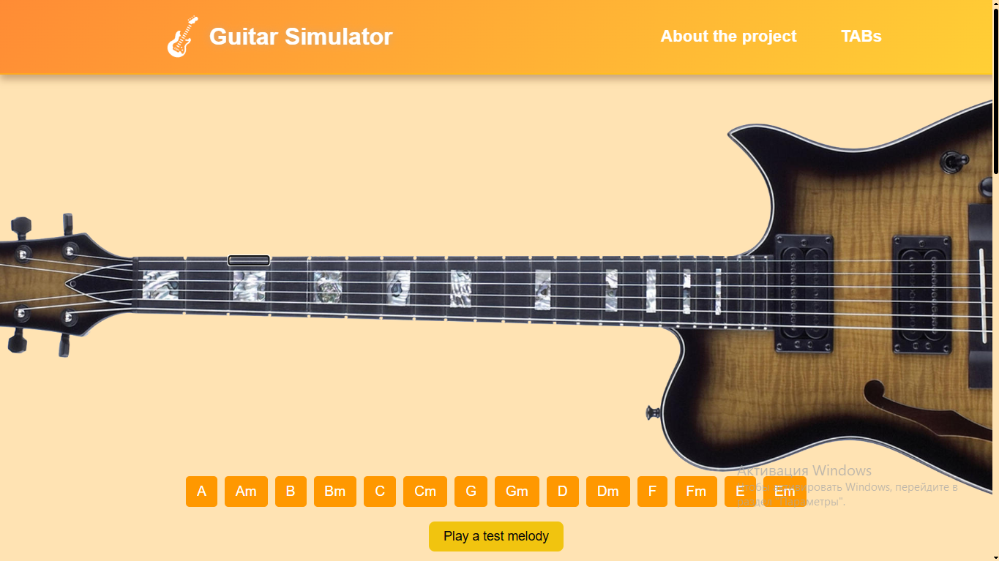
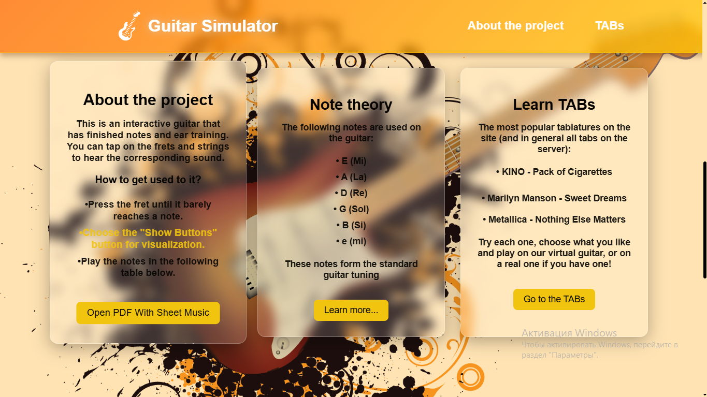

# 🎸 Virtual Guitar React

An atmospheric web application that simulates a meditative guitar experience through interactive fretboards, ambient styling, and sound-responsive design.

## Demo

[https://reshatel.github.io/Virtual-Guitar-React/](https://reshatel.github.io/Virtual-Guitar-React/)

## ✨ Features
* Interactive fretboard with chord playback
* Dynamic chord button system for exploration
* Ambient visual effects and stylized interface
* Responsive layout with immersive design aesthetics
* Learn and practice guitar tablatures in a meditative digital space
* Built-in theory insights and beginner-friendly guidance to help users grow with each chord
* Designed for both peaceful solo play and musical discovery — from gentle practice to expressive experimentation

## 🛠 Technologies

* [React](https://react.dev/)
* [React Scripts](https://create-react-app.dev/docs/getting-started/)
* Custom CSS animations and layout
* Audio playback integration
* GitHub Pages deployment

## Run Locally

### Option 1: Local dev server (recommended)

<pre>
npm install  
npm start
</pre>

### Option 2: View build folder

#### Using http-server

<pre>
cd path/to/build/folder  
http-server
</pre>

➡️ Available at: **http://localhost:8080**

#### Using serve

<pre>
cd path/to/build/folder  
serve -s .
</pre>

➡️ Available at: **http://localhost:5000**

##  Build and Deploy

<pre>
npm run build  
npm run deploy
</pre>

##  Author

Crafted with harmony and precision by [Reshatel](https://github.com/Reshatel) — blending interaction, sound, and visual design into a calm digital instrument.
